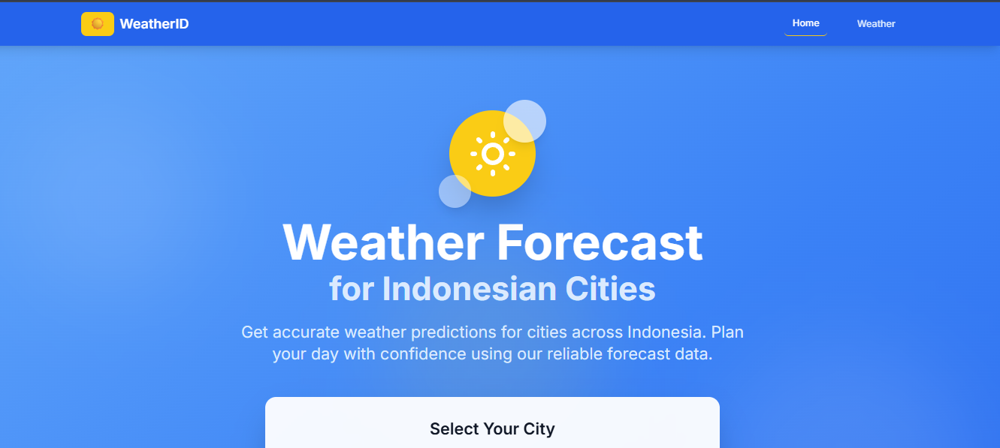
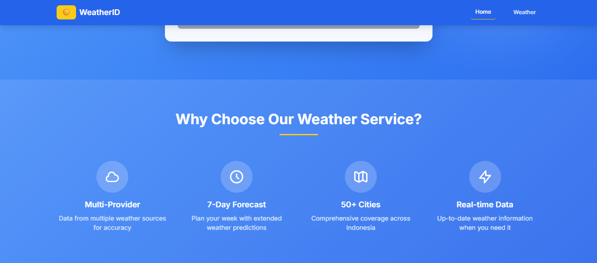
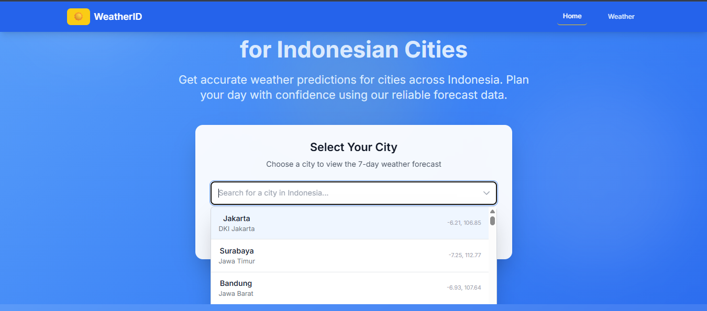
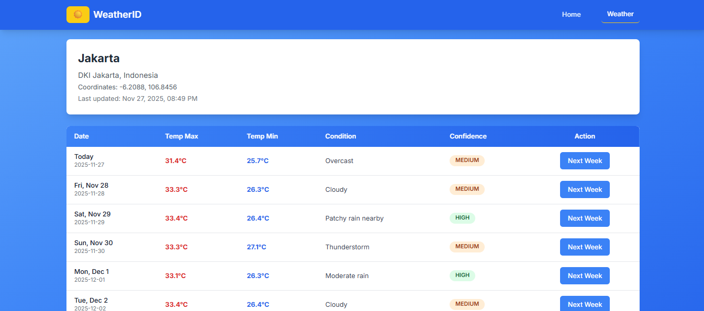
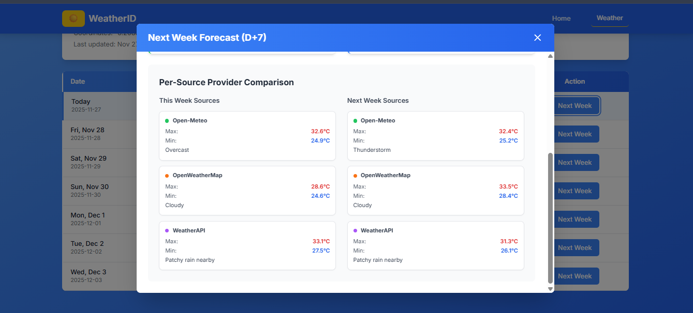
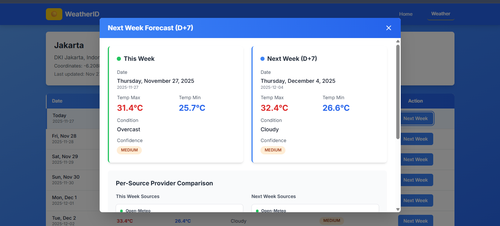

# Judul Projek 
_Web Service Ramalan Cuaca (WeatherID) Dengan Pendekatan Pemrograman Fungsional Menggunakan Rust_

**Penulis:** 1. Muhammad Rayhan Saputra, 2. Brikal Adhitama Santoso, 3. Risky Alfienda, 4 Rafly Taufika Fikri 

—

## Abstrak 
Perubahan cuaca yang cepat dan variatif di Indonesia menuntut tersedianya layanan informasi cuaca yang akurat dan mudah diakses. Dalam konteks ini, pemanfaatan paradigma pemrograman fungsional menjadi relevan untuk mengembangkan sistem yang lebih terstruktur, konsisten, dan andal. Rust, dengan keamanan memori dan performa tinggi yang diusungnya, menyediakan landasan yang kuat untuk implementasi layanan tersebut.

Proyek WeatherID Dengan slogan “Weather Forecast for Indonesia Cities” dirancang untuk menyediakan web service ramalan cuaca di Indonesia yang efisien dan terpercaya melalui integrasi pendekatan pemrograman fungsional menggunakan Rust. Pendekatan ini diharapkan mampu meningkatkan reliabilitas sistem sekaligus memperkuat kualitas penyajian informasi cuaca bagi pengguna.

— 

## Pembukaan 

Permasalahan yang kami angkat dari kondisi Indonesia sebagai negara tropis dengan curah hujan tinggi dan pola cuaca yang sering berubah secara tiba-tiba. Situasi ini menuntut ketersediaan informasi cuaca yang akurat, cepat, dan mudah diakses oleh masyarakat. Melalui web service yang kami bangun, kami menyediakan data cuaca yang lebih beragam karena mengintegrasikan berbagai sumber terpercaya, sehingga memungkinkan peningkatan akurasi dan memberikan gambaran kondisi cuaca yang lebih komprehensif. 

Kami memilih Rust untuk proyek prediksi cuaca di sebuah kota di Indonesia karena memberikan keuntungan dari sisi performa dan keamanan memori yang tinggi, sehingga mampu menangani perhitungan kompleks dan data cuaca yang besar dengan efisien. Selain itu, Rust mendukung paradigma pemrograman fungsional seperti immutability dan fungsi murni, yang memudahkan penulisan kode yang lebih prediktif dan mudah diuji, mengurangi potensi bug saat memproses data dari berbagai API cuaca.

Kami Menerapkan pemrograman fungsional pada proyek prediksi cuaca memiliki beberapa keuntungan yang sangat relevan hingga level multi proses CPU. Paradigma fungsional menekankan immutability (data tidak bisa diubah) dan fungsi murni (tanpa efek samping), sehingga setiap fungsi dapat dieksekusi secara independen. Ini membuat program lebih deterministik, mudah diuji, dan minim bug, terutama saat memproses banyak data cuaca dari berbagai API. Lebih jauh, karena fungsi murni tidak tergantung pada state global, mereka ideal untuk parallel processing. Beberapa fungsi bisa dijalankan secara bersamaan pada core CPU yang berbeda tanpa resiko race condition atau deadlock. Dengan kata lain, pemrograman fungsional memungkinkan proyek prediksi cuaca memanfaatkan full concurrency dari CPU modern, sehingga perhitungan statistik cuaca atau prediksi model bisa dilakukan lebih cepat dan efisien.

Solusi kami unik dan menarik karena menggabungkan pemrograman fungsional dengan Rust untuk membangun sistem prediksi cuaca yang cepat, aman, dan scalable, sekaligus memanfaatkan multi proses CPU untuk memproses data dari berbagai sumber secara paralel. Pendekatan ini memungkinkan prediksi yang lebih akurat dalam waktu nyata, dengan kode yang mudah diuji, minim bug, dan tahan terhadap kesalahan memori. Sesuatu yang jarang ditemukan pada proyek serupa yang biasanya memakai bahasa scripting atau OOP tradisional. Selain itu, integrasi beberapa API cuaca lokal dan global serta desain modular membuat sistem ini fleksibel, mudah diperluas, dan relevan bagi kebutuhan perkotaan di Indonesia. Kombinasi performa tinggi, keamanan, dan desain fungsional inilah yang membuat proyek ini menonjol.

## Latar Belakang dan Konsep 
Berikut beberapa key konsep yang relevan dengan proyek WeatherID:

1. Pemrograman Fungsional - Pendekatan ini menekankan fungsi murni dan immutability, membuat kode lebih mudah diuji, deterministik, dan bebas dari efek samping. Hal ini penting untuk memproses data cuaca dari banyak sumber tanpa resiko kesalahan state.


2. Concurrency dan Parallelism - Karena fungsi fungsional tidak bergantung pada state global, prediksi cuaca dapat dieksekusi secara paralel di beberapa core CPU, meningkatkan efisiensi dan kecepatan perhitungan data real-time.


3. Integrasi API - Proyek ini memanfaatkan beberapa sumber data cuaca (misalnya OpenWeatherMap, Open-Meteo, dan WeatherAPI), sehingga prediksi menjadi lebih akurat dan komprehensif dibanding hanya mengandalkan satu sumber.


4. Rust sebagai Bahasa Sistem - Rust menawarkan performa tinggi, manajemen memori aman, dan sistem tipe yang ketat, sehingga cocok untuk menangani perhitungan besar dan data streaming dari API tanpa crash atau memory leak.


5. Modularitas dan Skalabilitas - Desain kode yang modular memungkinkan penambahan fitur baru atau sumber API lain dengan mudah, membuat proyek siap untuk ekspansi ke kota atau wilayah lain di Indonesia.
—

## Stak Teknologi 
Rust 
Framework (Rocket)
Vue.js 
Async Runtime (Tokio)

—

## Sumber Kode dan Penjelasan 
## Tangkapan Layar
Halaman Landing Page

Halaman About Page

Search Box Lokasi Kota

Halaman Hasil Cuaca Sebuah Kota Dalam Rentang Waktu 1 Minggu

Halaman Referensi Cuaca Sebuah Kota di Beberapa Sumber Cuaca Dalam Waktu 1 minggu 

Halaman Hasil Cuaca Sebuah Kota Pada Hari Tertentu dan Perkiraannya di Minggu Berikutnya 

## backend/src/main.rs
 
entry point aplikasi Rust yang menginisialisasi Rocket web server dengan konfigurasi CORS, logger, service cuaca, cache, dan mekanisme shutdown graceful.
```
use rocket::fairing::AdHoc;
use rocket_cors::{CorsOptions, AllowedOrigins};
use log::info;
use std::sync::Arc;
use tokio::sync::{Notify, Semaphore};

mod routes;
mod services;
mod models;
mod utils;
mod cities;
mod errors;
mod runtime;

use utils::{Config, init_logger};
use routes::routes;
use services::{WeatherService, ForecastCache};
use models::EnsembleForecast;
use runtime::{init_runtime, log_runtime_config, WorkerPool, get_worker_count};

#[tokio::main(flavor = "multi_thread", worker_threads = 3)]
async fn main() {
    dotenvy::dotenv().ok();
    init_logger();
    init_runtime();
    log_runtime_config();
    let config = Config::from_env();

    info!("Starting IndoPrint API server on port {}", config.server_port);

    let worker_count = get_worker_count();
    let worker_pool = Arc::new(WorkerPool::new(worker_count));
    let semaphore = Arc::new(Semaphore::new(3));
    info!("Created rate limiting semaphore with 3 permits");

    let weather_service = WeatherService::new(
        config.openweather_key.clone(),
        config.weatherapi_key.clone(),
    );

    // Cache ensemble forecast: TTL 1 jam, max 100 entries
    let ensemble_cache = Arc::new(ForecastCache::<EnsembleForecast>::new(3600, 100));
    info!("Created ensemble forecast cache with 1 hour TTL");

    let shutdown = Arc::new(Notify::new());
    let shutdown_clone = shutdown.clone();

    // Handle graceful shutdown (CTRL-C / SIGTERM)
    tokio::spawn(async move {
        let ctrl_c = async {
            tokio::signal::ctrl_c()
                .await
                .expect("Failed to install CTRL-C signal handler");
        };

        #[cfg(unix)]
        let terminate = async {
            use tokio::signal::unix::{signal, SignalKind};
            signal(SignalKind::terminate())
                .expect("Failed to install SIGTERM signal handler")
                .recv()
                .await;
        };

        #[cfg(not(unix))]
        let terminate = std::future::pending::<()>();

        tokio::select! {
            () = ctrl_c => {
                info!("Received CTRL-C signal, initiating graceful shutdown...");
            }
            () = terminate => {
                info!("Received SIGTERM signal, initiating graceful shutdown...");
            }
        }
        shutdown_clone.notify_one();
    });

    let allowed_origins = AllowedOrigins::some_exact(&config.cors_origins);
    let cors = CorsOptions {
        allowed_origins,
        allowed_methods: vec![
            rocket::http::Method::Get,
            rocket::http::Method::Post,
            rocket::http::Method::Put,
            rocket::http::Method::Delete,
            rocket::http::Method::Options,
        ]
        .into_iter()
        .map(From::from)
        .collect(),
        allow_credentials: true,
        ..Default::default()
    }
    .to_cors()
    .expect("Error creating CORS");

    let figment = rocket::Config::figment()
        .merge(("port", config.server_port))
        .merge(("address", "0.0.0.0"));

    let rocket_instance = rocket::custom(figment)
        .manage(weather_service)
        .manage(worker_pool)
        .manage(semaphore)
        .manage(ensemble_cache)
        .manage(config.clone())
        .attach(cors)
        .attach(AdHoc::on_request("Request Logger", |req, _| {
            Box::pin(async move {
                info!("{} {}", req.method(), req.uri());
            })
        }))
        .attach(AdHoc::on_response("Response Logger", |_req, res| {
            Box::pin(async move {
                info!("Response status: {}", res.status());
            })
        }))
        .mount("/", routes());

    let launch_task = tokio::spawn(async move {
        let _ = rocket_instance.launch().await;
    });

    shutdown.notified().await;

    info!("Shutdown signal received, waiting for pending tasks to complete...");

    launch_task.abort();

    info!("Server shutdown complete");
}
```


## backend/src/models/mod.rs
Mendefinisikan struktur data umum seperti ApiResponse<T> untuk format respons API yang konsisten, ContactForm untuk form kontak, dan ServiceInfo untuk informasi layanan, serta mengeksport semua model terkait city, forecast, dan ensembl
```
use serde::{Deserialize, Serialize};

pub mod city;
pub mod forecast;
pub mod ensemble;
pub mod forecast_request;

#[allow(unused_imports)]
pub use city::City;
#[allow(unused_imports)]
pub use forecast::{DailyForecast, WeatherForecast};
#[allow(unused_imports)]
pub use ensemble::{
    DayEnsemble, EnsembleForecast, FinalForecast, PerSourceData, ProviderForecast,
};
#[allow(unused_imports)]
pub use forecast_request::{
    ForecastRequestParams,
    ForecastPeriodRequest,
    ForecastResponse,
};


#[allow(dead_code)]
#[derive(Debug, Clone, Serialize, Deserialize)]
pub struct ApiResponse<T> {
    pub success: bool,
    pub data: Option<T>,
    pub message: Option<String>,
    pub error: Option<String>,
}

#[allow(dead_code)]
impl<T> ApiResponse<T> {
    pub fn success(data: T) -> Self {
        Self {
            success: true,
            data: Some(data),
            message: None,
            error: None,
        }
    }


    pub fn error(message: String) -> Self {
        Self {
            success: false,
            data: None,
            message: None,
            error: Some(message),
        }
    }
}

#[allow(dead_code)]
#[derive(Debug, Clone, Serialize, Deserialize)]

pub struct ContactForm {
    pub name: String,
    pub email: String,
    pub phone: Option<String>,
    pub message: String,
}

#[allow(dead_code)]

#[derive(Debug, Clone, Serialize, Deserialize)]
pub struct ServiceInfo {
    pub id: String,
    pub name: String,
    pub description: String,
    pub price_range: Option<String>,
}

```


## backend/src/services/providers/weather_service.rs
service layer utama untuk mengambil data cuaca dengan strategi fallback: mencoba Open-Meteo (gratis) terlebih dahulu, lalu OpenWeatherMap dan WeatherAPI jika gagal. 
```
use crate::models::{WeatherForecast, City};
use log::{info, warn, error};
use chrono::Utc;
use std::sync::Arc;
use tokio::sync::Semaphore;

use super::providers::{
    fetch_open_meteo, 
    fetch_openweather, 
    fetch_weatherapi
};


use super::parallel_forecast::{fetch_forecast_parallel, fetch_forecast_with_rate_limit};

pub struct WeatherService {
    pub openweather_key: String,
    pub weatherapi_key: String,
}

impl WeatherService {
    pub fn new(openweather_key: String, weatherapi_key: String) -> Self {
        Self {
            openweather_key,
            weatherapi_key,
        }
    }

    
    pub async fn get_forecast(
        &self,
        city: &str,
        lat: f64,
        lon: f64,

    ) -> Result<WeatherForecast, String> {
        info!("Getting weather forecast for city={}, lat={}, lon={}", city, lat, lon);

       
        info!("Attempting to fetch from Open-Meteo provider");
        match fetch_open_meteo(lat, lon).await {
            
            Ok(forecast) => {
                info!("Successfully retrieved forecast from Open-Meteo");
                
                return Ok(WeatherForecast {
                    city: city.to_string(),
                    province: "".to_string(),
                    country: "Indonesia".to_string(),
                    latitude: lat,
                    longitude: lon,
                    last_updated: Utc::now().to_rfc3339(),
                    forecast,
                });
            }


            Err(e) => {
                warn!("Open-Meteo provider failed: {:?}", e);
            }
        }

        
        if !self.openweather_key.is_empty() && self.openweather_key != "your-key-here" {
            info!("Attempting to fetch from OpenWeatherMap provider");
            match fetch_openweather(lat, lon, &self.openweather_key).await 
            
            {
                Ok(forecast) => {
                    info!("Successfully retrieved forecast from OpenWeatherMap");

                    return Ok(WeatherForecast {
                        city: city.to_string(),
                        province: "".to_string(),
                        country: "Indonesia".to_string(),
                        
                        latitude: lat,
                        longitude: lon,
                        last_updated: Utc::now().to_rfc3339(),
                        forecast,
                    });
                }
                Err(e) => {
                    warn!("OpenWeatherMap provider failed: {:?}", e);
                }
            }

        } else {
            warn!("OpenWeatherMap API key not configured, skipping provider");
        }

       
       
        if !self.weatherapi_key.is_empty() && self.weatherapi_key != "your-key-here"
         {
            info!("Attempting to fetch from WeatherAPI provider");
            match fetch_weatherapi(city, &self.weatherapi_key).await {
                
                Ok(forecast) => {
                    
                    info!("Successfully retrieved forecast from WeatherAPI");
                    return Ok(WeatherForecast {
                        city: city.to_string(),
                        province: "".to_string(),
                        country: "Indonesia".to_string(),
                        latitude: lat,
                        longitude: lon,
                        last_updated: Utc::now().to_rfc3339(),
                        forecast,

                    });
                }
                Err(e) => {
                    warn!("WeatherAPI provider failed: {:?}", e);
                }
            }

        } else {
            warn!("WeatherAPI key not configured, skipping provider");
        }

        
        error!("All weather providers failed for city={}", city);
        Err(
            "Failed to fetch weather forecast from all available providers. \
             Please try again later or check your API configuration."
                .to_string(),
        )
    }

   
    pub async fn get_forecast_parallel(
        &self,
        city: &City,
    ) -> Result<WeatherForecast, String> {
        info!("Getting parallel weather forecast for city={}, lat={}, lon={}", 
              city.name, city.latitude, city.longitude);

        fetch_forecast_parallel(city, &self.openweather_key, &self.weatherapi_key).await
    }


    pub async fn get_forecast_rate_limited(
        &self,
        city: &City,
        semaphore: Arc<Semaphore>,

    ) -> Result<WeatherForecast, String> {
        info!("Getting rate-limited weather forecast for city={}, lat={}, lon={}", 
              city.name, city.latitude, city.longitude);

        fetch_forecast_with_rate_limit(city, semaphore, &self.openweather_key, &self.weatherapi_key).await
    }
}
```

## backend/src/services/providers/esemble.fetcher.rs

Mengambil data cuaca dari 3 provider secara paralel menggunakan tokio::join!, menggabungkan hasil dari setiap provider ke dalam PerSourceData, menghitung rata-rata suhu dan memilih kondisi cuaca yang paling umum, kemudian mengembalikan forecast 7 hari dengan minimal 3 hari harus berhasil.

```
use crate::models::{City, PerSourceData, ProviderForecast};
use crate::services::providers::{
    fetch_open_meteo, 
    fetch_openweather, 
    fetch_weatherapi
};

use log::{info, warn};
use futures::future::join_all;


pub async fn fetch_ensemble_day(
    day: usize,
    city: &City,
    openweather_key: &str,
    weatherapi_key: &str,

) -> Result<PerSourceData, String> {
    info!("[Ensemble] Fetching day {} for {} from all providers", day, city.name);
    
    
    let open_meteo_task = fetch_open_meteo(city.latitude, city.longitude);
    let open_weather_task = fetch_openweather(city.latitude, city.longitude, openweather_key);
    let weather_api_task = fetch_weatherapi(city.name, weatherapi_key);
    
    
    let results = tokio::join!(open_meteo_task, open_weather_task, weather_api_task);
    
    let mut per_source = PerSourceData::new();
    
    
    match results.0 {
        Ok(forecast) => {
            if forecast.len() > day 
            {
                let daily = &forecast[day];
                let provider_forecast = ProviderForecast::new(
                    daily.date.clone(),
                    daily.temp_max,
                    daily.temp_min,
                    daily.condition.clone(),
                );
                per_source = per_source.with_open_meteo(provider_forecast);
                info!("[Ensemble] Open-Meteo data available for day {}", day);

            } else {
                warn!("[Ensemble] Open-Meteo returned insufficient data for day {}", day);
            }
        }


        Err(e) => {
            warn!("[Ensemble] Open-Meteo failed: {}", e);
        }
    }
    

   

    if !openweather_key.is_empty() && openweather_key != 
    
    "your-key-here" {
        match results.1 {
            Ok(forecast) => {
                if forecast.len() > day {
                    let daily = &forecast[day];
                    let provider_forecast = ProviderForecast::new(
                        daily.date.clone(),
                        daily.temp_max,
                        daily.temp_min,
                        daily.condition.clone(),
                    );

                    per_source = per_source.with_open_weather(provider_forecast);
                    info!("[Ensemble] OpenWeatherMap data available for day {}", day);

                } else {
                    warn!("[Ensemble] OpenWeatherMap returned insufficient data for day {}", day);
                }
            }
            
            Err(e) => {
                warn!("[Ensemble] OpenWeatherMap failed: {}", e);
            }
        }
    } else {
        warn!("[Ensemble] OpenWeatherMap API key not configured");
    }
    

    if !weatherapi_key.is_empty() && weatherapi_key != "your-key-here" {
        match results.2 {
            Ok(forecast) => {
                if forecast.len() > day {
                    let daily = &forecast[day];
                    let provider_forecast = ProviderForecast::new(
                        daily.date.clone(),
                        daily.temp_max,
                        daily.temp_min,
                        daily.condition.clone(),
                    );
                    per_source = per_source.with_weather_api(provider_forecast);
                    info!("[Ensemble] WeatherAPI data available for day {}", day);
                } else {
                    warn!("[Ensemble] WeatherAPI returned insufficient data for day {}", day);
                }
            }
            Err(e) => {
                warn!("[Ensemble] WeatherAPI failed: {}", e);
            }
        }
    } else {
        warn!("[Ensemble] WeatherAPI key not configured");
    }
    
   

    if per_source.provider_count() == 0 {
        return Err(format!("All providers failed for day {}", day));
    }
    
    info!("[Ensemble] Day {}: {} provider(s) available", day, per_source.provider_count());
    Ok(per_source)
}


pub fn calculate_final_forecast(per_source: &PerSourceData, _date: String) -> Result<(f32, f32, String), String> {
    let (max_temps, min_temps) = per_source.extract_temperatures();
    let conditions = per_source.get_conditions();
    

    if max_temps.is_empty() || min_temps.is_empty() {
        return Err("No temperature data available".to_string());
    }
    
    

    let final_temp_max: f32 = max_temps.iter().sum::<f32>() / max_temps.len() as f32;
    let final_temp_min: f32 = min_temps.iter().sum::<f32>() / min_temps.len() as f32;
    

    let final_condition = if conditions.is_empty() {
        "Unknown".to_string()
    } else {
        
        
        let mut counts = std::collections::HashMap::new();
        for cond in &conditions {
            *counts.entry(cond.clone()).or_insert(0) += 1;
        }
        
        

        counts.into_iter()
            .max_by_key(|(_, count)| *count)
            .map(|(cond, _)| cond)
            .unwrap_or_else(|| conditions[0].clone())
    };
    
    Ok((final_temp_max, final_temp_min, final_condition))
}


pub async fn fetch_ensemble_week(
    city: &City,
    openweather_key: &str,
    weatherapi_key: &str,
) -> Result<Vec<PerSourceData>, String> {
    info!("[Ensemble] Fetching 7-day ensemble for {}", city.name);
    
    let mut futures = Vec::new();
    
    
    for day in 0..7 {
        let future = fetch_ensemble_day(day, city, openweather_key, weatherapi_key);
        futures.push(future);
    }
    
    
    let results = join_all(futures).await;
    
    let mut per_source_days = Vec::new();
    let mut failed_count = 0;
    
    for (day_idx, result) in results.into_iter().enumerate() {
        match result {
            Ok(per_source) => {
                per_source_days.push(per_source);
            }
            Err(e) => {
                warn!("[Ensemble] Day {} failed: {}", day_idx, e);
                failed_count += 1;
                

                per_source_days.push(PerSourceData::new());
            }
        }
    }
    
    
    if failed_count > 4 {
        return Err(format!("Too many failed days: {}/7", failed_count));
    }
    
    info!("[Ensemble] Successfully fetched ensemble data: {}/7 days", 7 - failed_count);
    Ok(per_source_days)
}

```


## backend/src/services/providers/confidence_calculator.rs
Menghitung tingkat kepercayaan forecast berdasarkan kesepakatan antar provider: HIGH jika 3 provider setuju dengan variance ±2°C, MEDIUM jika 2 provider atau variance ±3°C, LOW jika hanya 1 provider atau perbedaan signifikan. Menggunakan normalisasi kondisi cuaca untuk membandingkan hasil dari provider yang berbeda.

``` 
use crate::models::PerSourceData;
use log::debug;

/// Hitung tingkat kepercayaan berdasarkan kesepakatan antar provider api cuaca

/// rules:
/// - TINGGI: Ketiga penyedia api tersedia dan ( suhu  sama sama dalam ±2°C DAN kondisi cuaca cocok)
/// - SEDANG: 2 penyedia tersedia dan data konsisten, ATAU 3 penyedia dengan variasi kecil (±3°C)
/// - RENDAH: Hanya 1 penyedia tersedia, ATAU penyedia tidak sama secara signifikan (>±3°C atau kondisi berbeda)

pub fn calculate_confidence(per_source: &PerSourceData, _final_temps: (f32, f32)) -> String {
    let provider_count = per_source.provider_count();
    
    debug!("[ConfidenceCalc] Provider count: {}", provider_count);
    
    // LOW: Only 1 provider or no providers
    if provider_count <= 1 {
        debug!("[ConfidenceCalc] Only {} provider(s), returning LOW", provider_count);
        return "low".to_string();
    }
    
    let max_temps = per_source.get_max_temperatures();
    let min_temps = per_source.get_min_temperatures();
    let conditions = per_source.get_conditions();
    
    if max_temps.is_empty() || min_temps.is_empty() {
        debug!("[ConfidenceCalc] Missing temperature data, returning LOW");
        return "low".to_string();
    }
    
    // varian temperatur
    let max_variance = calculate_variance(&max_temps);
    let min_variance = calculate_variance(&min_temps);
    let avg_variance = (max_variance + min_variance) / 2.0;
    
    let condition_agreement = check_condition_agreement(&conditions);
    
    debug!(
        "[ConfidenceCalc] max_variance: {:.2}°C, min_variance: {:.2}°C, avg_variance: {:.2}°C, condition_agreement: {}",
        max_variance, min_variance, avg_variance, condition_agreement
    );
    
    // HIGH: 3 providers + tight temp agreement (±2°C) + condition agreement

    if provider_count == 3 && avg_variance <= 2.0 && condition_agreement {
        debug!("[ConfidenceCalc] 3 providers with tight agreement, returning HIGH");
        return "high".to_string();
    }
    
    // MEDIUM: 2  Providers + good temp agreement (±3°C)

    if provider_count == 2 && avg_variance <= 3.0 {
        debug!("[ConfidenceCalc] 2 providers with good agreement, returning MEDIUM");
        return "medium".to_string();
    }
    
    if provider_count == 3 && avg_variance <= 3.0 {
        debug!("[ConfidenceCalc] 3 providers with moderate variance, returning MEDIUM");
        return "medium".to_string();
    }
    
    // LOW: yang lainnya
    debug!("[ConfidenceCalc] Significant disagreement detected, returning LOW");
    "low".to_string()
}

/// hitung varians suhu sebagai deviasi maksimum dari rata-rata
fn calculate_variance(temps: &[f32]) -> f32 {
    if temps.is_empty() {
        return 0.0;
    }
    
    if temps.len() == 1 {
        return 0.0;
    }
    
    let sum: f32 = temps.iter().sum();
    let mean = sum / temps.len() as f32;
    
    
    let max_deviation = temps
        .iter()
        .map(|&t| (t - mean).abs())
        .fold(0.0, f32::max);
    
    max_deviation
}


fn check_condition_agreement(conditions: &[String]) -> bool {
    if conditions.is_empty() {
        return false;
    }
    
    if conditions.len() == 1 {
        return true;
    }
    
  
    let normalized: Vec<String> = conditions
        .iter()
        .map(|c| normalize_condition(c))
        .collect();
    
    
    let mut counts = std::collections::HashMap::new();
    for cond in &normalized {
        *counts.entry(cond.clone()).or_insert(0) += 1;
    }
    
   
    let max_count = counts.values().max().unwrap_or(&0);
    

    if normalized.len() == 2 {
        *max_count == 2
    } else {
        *max_count >= 2
    }
}


fn normalize_condition(condition: &str) -> String {
    let lower = condition.to_lowercase();
    
    

    if lower.contains("clear") || lower.contains("sunny") {
        "clear".to_string()
    } else if lower.contains("cloud") || lower.contains("overcast") {
        "cloudy".to_string()
    } else if lower.contains("rain") || lower.contains("drizzle") || lower.contains("shower") {
        "rainy".to_string()
    } else if lower.contains("storm") || lower.contains("thunder") {
        "stormy".to_string()
    } else if lower.contains("snow") || lower.contains("sleet") {
        "snowy".to_string()
    } else if lower.contains("fog") || lower.contains("mist") || lower.contains("haze") {
        "foggy".to_string()


    } else {
        
        lower
    }
}
```

## backend/src/services/providers/open_meteo.rs
Provider gratis tanpa API key yang mengambil data dari Open-Meteo API, menormalisasi response ke format DailyForecast

```
use serde::{Deserialize, Serialize};
use crate::models::DailyForecast;
use std::error::Error;
use reqwest::Client;
use std::time::Duration;
use log::info;

#[derive(Debug, Deserialize, Serialize, Clone)]
pub struct OpenMeteoDaily {
    pub time: Vec<String>,
    pub temperature_2m_max: Vec<f32>,
    pub temperature_2m_min: Vec<f32>,
    pub relative_humidity_2m_mean: Vec<u32>,
    pub weather_code: Vec<i32>,
}

#[derive(Debug, Deserialize, Serialize, Clone)]
pub struct OpenMeteoResponse {
    pub daily: OpenMeteoDaily,
}

pub async fn fetch_open_meteo(
    lat: f64,
    lon: f64,
) -> Result<Vec<DailyForecast>, Box<dyn Error + Send + Sync>> {
    info!("Fetching weather from Open-Meteo provider for lat={}, lon={}", lat, lon);

    let client = Client::builder()
        .timeout(Duration::from_secs(5))
        .build()?;

    let url = format!(
        "https://api.open-meteo.com/v1/forecast?latitude={}&longitude={}&daily=temperature_2m_max,temperature_2m_min,relative_humidity_2m_mean,weather_code&timezone=Asia/Jakarta",
        lat, lon
    );

    let response = client.get(&url).send().await?;
    let data: OpenMeteoResponse = response.json().await?;

    info!("Successfully fetched Open-Meteo data");

    // Normalize to DailyForecast
    let forecasts = normalize_open_meteo(&data)?;
    Ok(forecasts)
}

fn normalize_open_meteo(data: &OpenMeteoResponse) -> Result<Vec<DailyForecast>, Box<dyn Error + Send + Sync>> {
    let mut forecasts = Vec::new();
    let daily = &data.daily;

    // Take only first 7 days
    let days_count = std::cmp::min(7, daily.time.len());

    for i in 0..days_count {
        let temp_max = daily.temperature_2m_max[i];
        let temp_min = daily.temperature_2m_min[i];
        let temp_avg = (temp_max + temp_min) / 2.0;
        let humidity = daily.relative_humidity_2m_mean[i];
        let weather_code = daily.weather_code[i];

        let (condition, icon) = map_wmo_code(weather_code);

        forecasts.push(DailyForecast {
            date: daily.time[i].clone(),
            temp_max,
            temp_min,
            temp_avg,
            condition,
            humidity,
            wind_speed: 0.0, // Open-Meteo free tier doesn't provide wind_speed in daily forecast
            icon,
        });
    }

    Ok(forecasts)
}


fn map_wmo_code(code: i32) -> (String, String) {
    let (condition, icon) = match code {
        0 => ("Clear sky", "sunny"),
        1 | 2 => ("Mostly clear", "sunny"),
        3 => ("Overcast", "cloudy"),
        45 | 48 => ("Foggy", "fog"),
        51 | 53 | 55 => ("Light drizzle", "rainy"),
        61 | 63 | 65 => ("Rain", "rainy"),
        71 | 73 | 75 => ("Snow", "snowy"),
        77 => ("Snow grains", "snowy"),
        80 | 82 | 81 => ("Rain showers", "rainy"),
        85 | 86 => ("Snow showers", "snowy"),
        95 | 96 | 99 => ("Thunderstorm", "stormy"),
        _ => ("Unknown", "cloudy"),
    };
    (condition.to_string(), icon.to_string())
}

```

## backend/src/servies/providers/openweather.rs


 Provider mengambil data (dengan interval 3 jam), menggabungkan data per hari untuk mendapatkan max/min/avg temperature,

```
use serde::{Deserialize, Serialize};
use crate::models::DailyForecast;
use std::error::Error;
use reqwest::Client;
use std::time::Duration;
use log::info;
use chrono::{DateTime, Utc};

#[derive(Debug, Deserialize, Serialize, Clone)]
pub struct OpenWeatherMain {
    pub temp_max: f32,
    pub temp_min: f32,
    pub humidity: u32,
}

#[derive(Debug, Deserialize, Serialize, Clone)]
pub struct OpenWeatherWeather {
    pub main: String,
    pub description: String,
}

#[derive(Debug, Deserialize, Serialize, Clone)]
pub struct OpenWeatherListItem {
    pub dt: i64,
    pub main: OpenWeatherMain,
    pub weather: Vec<OpenWeatherWeather>,
    pub wind: Option<OpenWeatherWind>,
}

#[derive(Debug, Deserialize, Serialize, Clone)]
pub struct OpenWeatherWind {
    pub speed: f32,
}

#[derive(Debug, Deserialize, Serialize, Clone)]
pub struct OpenWeatherResponse {
    pub list: Vec<OpenWeatherListItem>,
}

pub async fn fetch_openweather(
    lat: f64,
    lon: f64,
    api_key: &str,
) -> Result<Vec<DailyForecast>, Box<dyn Error + Send + Sync>> {
    info!("Fetching weather from OpenWeatherMap provider for lat={}, lon={}", lat, lon);


    let client = Client::builder()
        .timeout(Duration::from_secs(5))
        .build()?;

    let url = format!(
        "https://api.openweathermap.org/data/2.5/forecast?lat={}&lon={}&appid={}&units=metric",
        lat, lon, api_key
    );

    let response = client.get(&url).send().await?;
    let data: OpenWeatherResponse = response.json().await?;

    info!("Successfully fetched OpenWeatherMap data");

    // Normalize to DailyForecast
    let forecasts = normalize_openweather(&data)?;
    Ok(forecasts)
}

fn normalize_openweather(data: &OpenWeatherResponse) -> Result<Vec<DailyForecast>, Box<dyn Error + Send + Sync>> {
    
    if data.list.is_empty() {
        return Err("No weather data available".into());
    }

    let mut daily_forecasts: Vec<DailyForecast> = Vec::new();
    let mut current_date = String::new();
    let mut current_max_temp = f32::MIN;
    
    let mut current_min_temp = f32::MAX;
    let mut current_humidity = 0u32;
    
    let mut current_wind_speed = 0.0f32;
    let mut current_weather = String::new();
    let mut current_icon = String::new();

    for item in &data.list {
        let dt = DateTime::<Utc>::from_timestamp(item.dt, 0)
            .ok_or("Invalid timestamp")?;
        let date = dt.format("%Y-%m-%d").to_string();

        
        if !current_date.is_empty() && current_date != date {
            let temp_avg = (current_max_temp + current_min_temp) / 2.0;
            
            daily_forecasts.push(DailyForecast {
                date: current_date.clone(),
                temp_max: current_max_temp,
                temp_min: current_min_temp,
                temp_avg,
                condition: current_weather.clone(),
                humidity: current_humidity,
                wind_speed: current_wind_speed,
                icon: current_icon.clone(),
            });

            current_max_temp = f32::MIN;
            current_min_temp = f32::MAX;
            #[allow(unused_assignments)]
            {
                current_humidity = 0;
                current_wind_speed = 0.0;
            }
        }

        current_date = date;
        current_max_temp = current_max_temp.max(item.main.temp_max);
        
        current_min_temp = current_min_temp.min(item.main.temp_min);
        current_humidity = item.main.humidity;
        current_wind_speed = item.wind.as_ref().map(|w| w.speed).unwrap_or(0.0);

        if !item.weather.is_empty() {
            let (condition, icon) = map_openweather_condition(&item.weather[0].main);
            current_weather = condition.to_string();
            current_icon = icon.to_string();
        }
    }

    if !current_date.is_empty() {
        let temp_avg = (current_max_temp + current_min_temp) / 2.0;
        daily_forecasts.push(DailyForecast {
            date: current_date,
            temp_max: current_max_temp,
            temp_min: current_min_temp,
            temp_avg,
            
            condition: current_weather,
            humidity: current_humidity,
            wind_speed: current_wind_speed,
            icon: current_icon,
        });
    }

    /
    while daily_forecasts.len() < 7 {
        if let Some(last_day) = daily_forecasts.last() {
            let mut new_day = last_day.clone();
            
            let days_to_add = (daily_forecasts.len() as i64) - 4;
            
            let base_date = match chrono::NaiveDate::parse_from_str(&last_day.date, "%Y-%m-%d") {
                Ok(d) => d,
                Err(_) => chrono::Local::now().date_naive(),
            };
           
            if let Some(new_date) = base_date.checked_add_signed(chrono::Duration::days(days_to_add)) {
                new_day.date = new_date.format("%Y-%m-%d").to_string();
                daily_forecasts.push(new_day);
            } else {
                break;
            }
        } else {
            break;
        }
    }

    Ok(daily_forecasts.into_iter().take(7).collect())
}

fn map_openweather_condition(condition: &str) -> (&'static str, &'static str) {
    match condition.to_lowercase().as_str() {
        "clear" => ("Clear", "sunny"),
        "clouds" => ("Cloudy", "cloudy"),
        "rain" => ("Rainy", "rainy"),
        "snow" => ("Snow", "snowy"),
        "drizzle" => ("Drizzle", "rainy"),
        "mist" | "smoke" | "haze" | "dust" | "fog" | "sand" | "ash" | "squall" | "tornado" => ("Foggy", "fog"),
        "thunderstorm" => ("Thunderstorm", "stormy"),
        _ => ("Unknown", "cloudy"),
    }
}

```

## backend/src/services/providers/mod.rs
  Mendefinisikan struktur data umum seperti ApiResponse<T> untuk format respons API yang konsisten,dan ServiceInfo untuk informasi layanan, serta mengeksport semua model terkait city, forecast, dan ensemble

```
use serde::{Deserialize, Serialize};
use crate::models::DailyForecast;
use std::error::Error;
use reqwest::Client;
use std::time::Duration;
use log::info;

#[derive(Debug, Deserialize, Serialize, Clone)]
pub struct WeatherAPIDay {
    pub maxtemp_c: f32,
    pub mintemp_c: f32,
    pub avgtemp_c: f32,
    pub avghumidity: u32,
    pub condition: WeatherAPICondition,
}

#[derive(Debug, Deserialize, Serialize, Clone)]
pub struct WeatherAPICondition {
    pub text: String,
    pub icon: String,
}

#[derive(Debug, Deserialize, Serialize, Clone)]
pub struct WeatherAPIForecastDay {
    pub date: String,
    pub day: WeatherAPIDay,
}

#[derive(Debug, Deserialize, Serialize, Clone)]
pub struct WeatherAPIForecast {
    pub forecastday: Vec<WeatherAPIForecastDay>,
}

#[derive(Debug, Deserialize, Serialize, Clone)]
pub struct WeatherAPIResponse {
    pub forecast: WeatherAPIForecast,
}

pub async fn fetch_weatherapi(
    city: &str,
    api_key: &str,
) -> Result<Vec<DailyForecast>, Box<dyn Error + Send + Sync>> {
    info!("Fetching weather from WeatherAPI provider for city={}", city);

    let client = Client::builder()
        .timeout(Duration::from_secs(5))
        .build()?;

    let url = format!(
        "https://api.weatherapi.com/v1/forecast.json?key={}&q={}&days=7&aqi=no",
        api_key, city
    );

    let response = client.get(&url).send().await?;
    let data: WeatherAPIResponse = response.json().await?;

    info!("Successfully fetched WeatherAPI data");

    // Normalize to DailyForecast
    let forecasts = normalize_weatherapi(&data)?;
    Ok(forecasts)
}

fn normalize_weatherapi(data: &WeatherAPIResponse) -> Result<Vec<DailyForecast>, Box<dyn Error + Send + Sync>> {
    let mut forecasts = Vec::new();

    for forecast_day in &data.forecast.forecastday {
        let condition = normalize_weatherapi_condition(&forecast_day.day.condition.text);
        let icon = map_weatherapi_icon(&forecast_day.day.condition.icon);

        forecasts.push(DailyForecast {
            date: forecast_day.date.clone(),
            temp_max: forecast_day.day.maxtemp_c,
            temp_min: forecast_day.day.mintemp_c,
            temp_avg: forecast_day.day.avgtemp_c,
            condition,
            humidity: forecast_day.day.avghumidity,
            wind_speed: 0.0, // WeatherAPI provides this, but for simplicity we'll keep it 0
            icon,
        });
    }

    Ok(forecasts)
}

fn normalize_weatherapi_condition(condition: &str) -> String {
    match condition {
        c if c.contains("Clear") || c.contains("Sunny") => "Clear".to_string(),
        c if c.contains("Cloud") => "Cloudy".to_string(),
        c if c.contains("Rain") => "Rainy".to_string(),
        c if c.contains("Snow") => "Snowy".to_string(),
        c if c.contains("Sleet") => "Sleet".to_string(),
        c if c.contains("Fog") => "Foggy".to_string(),
        c if c.contains("Thunder") => "Thunderstorm".to_string(),
        c if c.contains("Mist") => "Misty".to_string(),
        _ => condition.to_string(),
    }
}
```


## backend/src/routes/weather.rs

untuk Mendefinisikan 3 endpoint API: /api/cities untuk list semua kota, /api/weather untuk forecast dengan rate limiting, /api/weather/parallel untuk forecast tanpa rate limiting, dan /api/weather/ensemble untuk forecast multi-provider parameter city/period/day.

```
use rocket::{get, State, serde::json::Json, http::Status};
use log::{info, warn, error, debug};
use crate::models::{WeatherForecast, City, EnsembleForecast, ForecastPeriodRequest};
use crate::services::{WeatherService, ForecastCache, EnsembleOrchestrator, find_city, validate_city_input, get_all_cities};
use crate::utils::Config;
use crate::errors::{ApiError, ErrorResponse};
use serde::{Serialize, Deserialize};
use std::sync::Arc;
use tokio::sync::Semaphore;

#[derive(Debug, Serialize, Deserialize)]
pub struct CitiesResponse {
    pub cities: Vec<CityResponse>,
}

#[derive(Debug, Serialize, Deserialize)]
pub struct CityResponse {
    pub id: u32,
    pub name: String,
    pub province: String,
    pub latitude: f64,
    pub longitude: f64,
}

impl From<&City> for CityResponse {
    fn from(city: &City) -> Self {
        Self {
            id: city.id,
            name: city.name.to_string(),
            province: city.province.to_string(),
            latitude: city.latitude,
            longitude: city.longitude,
        }
    }
}

#[get("/api/cities")]
pub fn get_cities() -> Json<CitiesResponse> {
    let all_cities = get_all_cities();
    info!("GET /api/cities - Fetching all {} cities", all_cities.len());
    let cities = all_cities.iter().map(CityResponse::from).collect();
    Json(CitiesResponse { cities })
}

#[get("/api/weather?<city>")]
pub async fn get_weather(
    city: Option<String>,
    weather_service: &State<WeatherService>,
    semaphore: &State<Arc<Semaphore>>,
) -> Result<Json<WeatherForecast>, (Status, Json<ErrorResponse>)> {
    

    let city_str = match city {
        Some(c) => c,
        None => {
            let err = ApiError::invalid_params("Missing required query parameter: city");
            warn!("[Weather] {}", err);
            return Err(err.to_response());
        }
    };


    let city_name = match validate_city_input(&city_str) {
        Ok(valid) => valid,
        Err(e) => {
            warn!("[Weather] Invalid city input '{}': {}", city_str, e);
            return Err(e.to_response());
        }
    };

    
    let city_data = match find_city(&city_name) {
        Ok(c) => c,
        Err(e) => {
            warn!("[Weather] City not found: '{}'", city_name);
            return Err(e.to_response());
        }
    };

    info!("[Weather] GET /api/weather?city={} - Looking up forecast (rate-limited parallel)", city_name);
    debug!("[Weather] City coordinates: ({}, {})", city_data.latitude, city_data.longitude);

    
    match weather_service.get_forecast_rate_limited(city_data, semaphore.inner().clone()).await 
    {
        Ok(mut forecast) => {
            forecast.province = city_data.province.to_string();
            info!("[Weather] Successfully retrieved forecast for {} with {} days", city_name, forecast.forecast.len());
            Ok(Json(forecast))
        }
        Err(e) => {
            error!("[Weather] Provider error for city '{}': {}", city_name, e);
            let err = ApiError::provider_error(&e);
            Err(err.to_response())
        }
    }
}

#[get("/api/weather/parallel?<city>")]
pub async fn get_weather_parallel(
    city: Option<String>,
    weather_service: &State<WeatherService>,
) -> Result<Json<WeatherForecast>, (Status, Json<ErrorResponse>)> {
    // Validate city parameter exists
    let city_str = match city {
        Some(c) => c,
        None => {
            let err = ApiError::invalid_params("Missing required query parameter: city");
            warn!("[WeatherParallel] {}", err);
            return Err(err.to_response());
        }
    };

 
    let city_name = match validate_city_input(&city_str) {
        Ok(valid) => valid,
        Err(e) => {
            warn!("[WeatherParallel] Invalid city input '{}': {}", city_str, e);
            return Err(e.to_response());
        }
    };

    
    let city_data = match find_city(&city_name) {
        Ok(c) => c,
        Err(e) => {
            warn!("[WeatherParallel] City not found: '{}'", city_name);
            return Err(e.to_response());
        }
    };

    info!("[WeatherParallel] GET /api/weather/parallel?city={} - Looking up forecast (unlimited parallel)", city_name);


    debug!("[WeatherParallel] City coordinates: ({}, {})", city_data.latitude, city_data.longitude);

   
    match weather_service.get_forecast_parallel(city_data).await {
        Ok(mut forecast) => {
            forecast.province = city_data.province.to_string();
            info!("[WeatherParallel] Successfully retrieved forecast for {} with {} days", city_name, forecast.forecast.len());
            Ok(Json(forecast))
        }


        Err(e) => {
            error!("[WeatherParallel] Provider error for city '{}': {}", city_name, e);
            let err = ApiError::provider_error(&e);
            Err(err.to_response())
        }
    }
}

#[get("/api/weather/ensemble?<city>&<period>&<day>")]
pub async fn get_ensemble_forecast(
    city: Option<String>,
    period: Option<String>,
    day: Option<u32>,
    cache: &State<Arc<ForecastCache<EnsembleForecast>>>,
    config: &State<Config>,
) -> Result<Json<EnsembleForecast>, (Status, Json<ErrorResponse>)> {
    

    let city_str = match city {
        Some(c) => c,
        None => {
            let err = ApiError::invalid_params("Missing required query parameter: city");
            warn!("[Ensemble] {}", err);
            return Err(err.to_response());
        }
    };

    
    let city_name = match validate_city_input(&city_str) {
        Ok(valid) => valid,
        Err(e) => {
            warn!("[Ensemble] Invalid city input '{}': {}", city_str, e);
            return Err(e.to_response());
        }
    };

    
    let city_data = match find_city(&city_name) {
        Ok(c) => c,
        Err(e) => {
            error!("[Ensemble] City validation failed for: '{}'", city_name);
            return Err(e.to_response());
        }
    };

    
    let period_str = period.as_deref().unwrap_or("current_week");
    debug!("[Ensemble] Query params - city: {}, period: {:?}, day: {:?}", city_name, &period, day);

    
    if period_str == "next_week" {
        if day.is_none() {
            let err = ApiError::invalid_params("Day parameter required for next_week period");
            warn!("[Ensemble] {}", err);
            return Err(err.to_response());
        }
        
        if let Some(d) = day {
            if d > 6 {
                let err = ApiError::invalid_params("Day must be 0-6 (Monday-Sunday)");

                warn!("[Ensemble] Invalid day parameter: {}", d);
                return Err(err.to_response());
            }
        }
    }

    
    let forecast_period = match ForecastPeriodRequest::from_query(period.clone(), day) 
    
    {
        Ok(p) => p,
        Err(e) => {
            warn!("[Ensemble] Invalid forecast period: {}", e);
            let err = ApiError::invalid_params(&e);
            return Err(err.to_response());
        }
    };

    info!(
        "[Ensemble] GET /api/weather/ensemble?city={}&period={} - Fetching ensemble forecast",
        city_name,
        period_str

    );
    debug!("[Ensemble] Forecast period: {:?}", forecast_period);

    
    
    let orchestrator = EnsembleOrchestrator::new(
        cache.inner().clone(),
        config.openweather_key.clone(),
        config.weatherapi_key.clone(),
    );

    
    match orchestrator.get_forecast(city_data, forecast_period).await {
        Ok(ensemble) => {
            info!(
                "[Ensemble] Successfully fetched ensemble forecast for {} with {} days",
                city_name,
                ensemble.days.len()
            );
            Ok(Json(ensemble))
        }
        Err(e) => {
            error!("[Ensemble] Failed to fetch ensemble forecast for '{}': {}", city_name, e);
            let err = ApiError::provider_error(&e);
            Err(err.to_response())
        }
    }
}

```

## backend/src/data/cities.rs
Database statis berisi 50 kota besar Indonesia dengan koordinat geografis (latitude/longitude) yang akurat, mencakup semua provinsi dari Aceh hingga Papua untuk keperluan lookup data cuaca berdasarkan nama kota

```
use crate::models::City;

pub const CITIES: &[City] = &[
    City { id: 1, name: "Jakarta", province: "DKI Jakarta", latitude: -6.2088, longitude: 106.8456 },
    City { id: 2, name: "Surabaya", province: "Jawa Timur", latitude: -7.2504, longitude: 112.7688 },
    City { id: 3, name: "Bandung", province: "Jawa Barat", latitude: -6.9271, longitude: 107.6411 },
    City { id: 4, name: "Medan", province: "Sumatera Utara", latitude: 3.1952, longitude: 98.6722 },
    City { id: 5, name: "Bekasi", province: "Jawa Barat", latitude: -6.2349, longitude: 106.9896 },
    City { id: 6, name: "Depok", province: "Jawa Barat", latitude: -6.4029, longitude: 106.8231 },
    City { id: 7, name: "Tangerang", province: "Banten", latitude: -6.1728, longitude: 106.6326 },
    City { id: 8, name: "Tangerang Selatan", province: "Banten", latitude: -6.2957, longitude: 106.7338 },
    City { id: 9, name: "Semarang", province: "Jawa Tengah", latitude: -6.9667, longitude: 110.4167 },
    City { id: 10, name: "Makassar", province: "Sulawesi Selatan", latitude: -5.3520, longitude: 119.4432 },
    City { id: 11, name: "Palembang", province: "Sumatera Selatan", latitude: -2.9760, longitude: 104.7553 },
    City { id: 12, name: "Batam", province: "Kepulauan Riau", latitude: 1.1271, longitude: 104.0073 },
    City { id: 13, name: "Bogor", province: "Jawa Barat", latitude: -6.6007, longitude: 106.7957 },
    City { id: 14, name: "Bandar Lampung", province: "Lampung", latitude: -5.3971, longitude: 105.2668 },
    City { id: 15, name: "Pekanbaru", province: "Riau", latitude: 0.5071, longitude: 101.4472 },
    City { id: 16, name: "Denpasar", province: "Bali", latitude: -8.6705, longitude: 115.2126 },
    City { id: 17, name: "Malang", province: "Jawa Timur", latitude: -7.9827, longitude: 112.6345 },
    City { id: 18, name: "Yogyakarta", province: "DI Yogyakarta", latitude: -7.7956, longitude: 110.3695 },
    City { id: 19, name: "Padang", province: "Sumatera Barat", latitude: -0.9492, longitude: 100.4172 },
    City { id: 20, name: "Manado", province: "Sulawesi Utara", latitude: 1.4748, longitude: 124.8628 },
    City { id: 21, name: "Banjarmasin", province: "Kalimantan Selatan", latitude: -3.3286, longitude: 114.5904 },
    City { id: 22, name: "Pontianak", province: "Kalimantan Barat", latitude: -0.0263, longitude: 109.3425 },
    City { id: 23, name: "Balikpapan", province: "Kalimantan Timur", latitude: -1.2671, longitude: 116.8326 },
    City { id: 24, name: "Samarinda", province: "Kalimantan Timur", latitude: -0.5, longitude: 117.1667 },
    City { id: 25, name: "Mataram", province: "NTB", latitude: -8.6500, longitude: 116.6333 },
    City { id: 26, name: "Kupang", province: "NTT", latitude: -10.1667, longitude: 123.6167 },
    City { id: 27, name: "Bengkulu", province: "Bengkulu", latitude: -3.8003, longitude: 102.2718 },
    City { id: 28, name: "Jambi", province: "Jambi", latitude: -1.6114, longitude: 103.6111 },
    City { id: 29, name: "Surakarta", province: "Jawa Tengah", latitude: -7.5505, longitude: 110.8063 },
    City { id: 30, name: "Magelang", province: "Jawa Tengah", latitude: -7.4744, longitude: 110.2144 },
    City { id: 31, name: "Cirebon", province: "Jawa Barat", latitude: -6.7049, longitude: 108.4449 },
    City { id: 32, name: "Tasikmalaya", province: "Jawa Barat", latitude: -7.3245, longitude: 108.2256 },
    City { id: 33, name: "Cimahi", province: "Jawa Barat", latitude: -6.8869, longitude: 107.5436 },
    City { id: 34, name: "Kediri", province: "Jawa Timur", latitude: -7.2452, longitude: 111.9015 },
    City { id: 35, name: "Madiun", province: "Jawa Timur", latitude: -7.6309, longitude: 111.5278 },
    City { id: 36, name: "Tegal", province: "Jawa Tengah", latitude: -6.8689, longitude: 109.1433 },
    City { id: 37, name: "Pekalongan", province: "Jawa Tengah", latitude: -6.8902, longitude: 109.6867 },
    City { id: 38, name: "Probolinggo", province: "Jawa Timur", latitude: -7.7252, longitude: 112.7920 },
    City { id: 39, name: "Pasuruan", province: "Jawa Timur", latitude: -7.6428, longitude: 112.9064 },
    City { id: 40, name: "Mojokerto", province: "Jawa Timur", latitude: -7.4728, longitude: 112.4292 },
    City { id: 41, name: "Serang", province: "Banten", latitude: -6.4042, longitude: 106.1496 },
    City { id: 42, name: "Ambon", province: "Maluku", latitude: -3.6959, longitude: 128.1814 },
    City { id: 43, name: "Ternate", province: "Maluku Utara", latitude: 0.7934, longitude: 127.3795 },
    City { id: 44, name: "Jayapura", province: "Papua", latitude: -2.5897, longitude: 140.6695 },
    City { id: 45, name: "Manokwari", province: "Papua Barat", latitude: -0.8667, longitude: 131.0836 },
    City { id: 46, name: "Gorontalo", province: "Gorontalo", latitude: 0.5272, longitude: 123.0564 },
    City { id: 47, name: "Kendari", province: "Sulawesi Tenggara", latitude: -3.9693, longitude: 122.5105 },
    City { id: 48, name: "Palu", province: "Sulawesi Tengah", latitude: -0.8917, longitude: 119.8701 },
    City { id: 49, name: "Banda Aceh", province: "Aceh", latitude: 5.5577, longitude: 95.3222 },
    City { id: 50, name: "Solo", province: "Jawa Tengah", latitude: -7.5505, longitude: 110.8063 },
];

```
## Kesimpulan 
Secara keseluruhan, proyek WeatherID menghadirkan sistem prediksi cuaca yang akurat, cepat, dan andal dengan memanfaatkan beberapa sumber API sekaligus untuk mendapatkan data yang lengkap. Penggunaan Rust dengan pendekatan pemrograman fungsional memastikan kode yang aman, minim bug, dan mudah dijalankan secara paralel pada multiproses CPU, sehingga perhitungan prediksi dapat dilakukan secara efisien. Dengan desain modular dan kemampuan untuk memproses data real-time, proyek ini tidak hanya memberikan informasi cuaca yang relevan bagi masyarakat, tetapi juga menunjukkan bagaimana kombinasi performansi tinggi dan paradigma fungsional dapat menghadirkan solusi inovatif untuk kebutuhan perkotaan di Indonesia.
